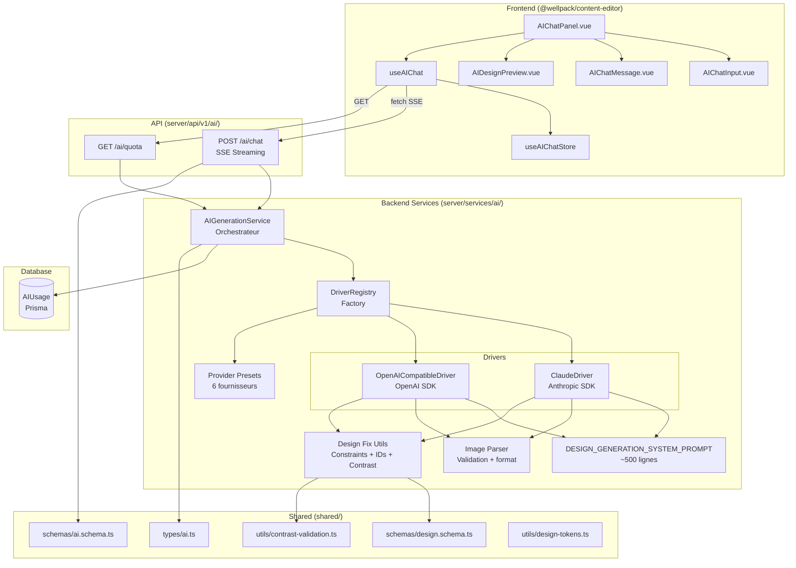
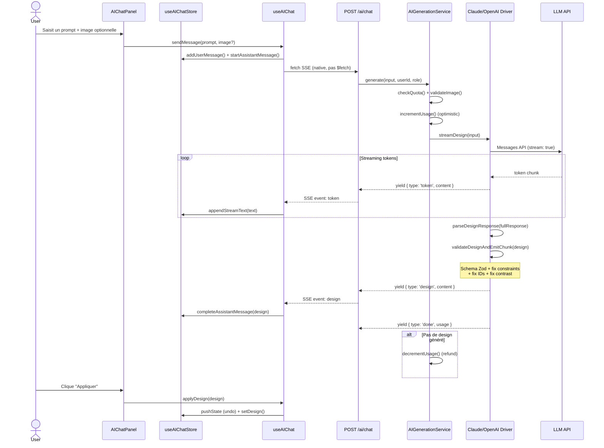
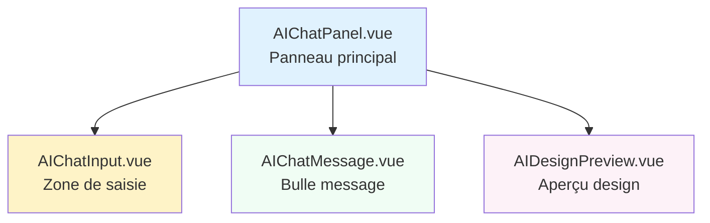
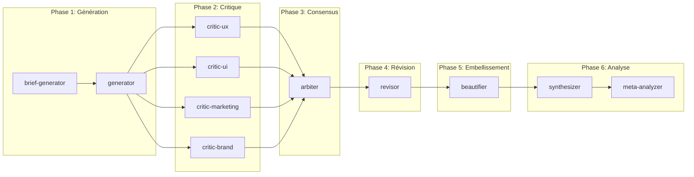

# Architecture IA — Kreo

> Cartographie exhaustive de tous les fichiers liés à l'intelligence artificielle dans le projet Kreo.
> Dernière mise à jour : 2026-02-11
>
> **Note** : les composants frontend éditeur (`stores/aiChat`, `composables/useAIChat`, `components/ai/*`)
> ont été extraits dans le package `@wellpack/content-editor`. Les chemins `@wellpack/content-editor/` ci-dessous
> correspondent à ce package externe.

---

## Table des matières

1. [Vue d'ensemble](#vue-densemble)
2. [Diagramme d'architecture](#diagramme-darchitecture)
3. [Flux de données — Génération en temps réel](#flux-de-données--génération-en-temps-réel)
4. [Backend — Services IA](#backend--services-ia)
   - [Service de génération](#service-de-génération)
   - [Système de drivers](#système-de-drivers)
   - [Presets fournisseurs](#presets-fournisseurs)
   - [Parseur d'images](#parseur-dimages)
   - [Prompt de génération](#prompt-de-génération)
   - [Utilitaires de fix design](#utilitaires-de-fix-design)
5. [Endpoints API](#endpoints-api)
6. [Types & Schémas partagés](#types--schémas-partagés)
   - [Types TypeScript](#types-typescript)
   - [Schémas Zod](#schémas-zod)
   - [Validation de contraste](#validation-de-contraste)
   - [Design tokens](#design-tokens)
7. [Frontend — Store & Composable](#frontend--store--composable)
   - [Store Pinia (aiChat)](#store-pinia-aichat)
   - [Composable useAIChat](#composable-useaichat)
8. [Frontend — Composants UI](#frontend--composants-ui)
9. [Base de données](#base-de-données)
10. [Pipeline batch LP](#pipeline-batch-lp)
    - [Orchestrateur](#orchestrateur)
    - [Prompts agents](#prompts-agents)
    - [Structure des runs](#structure-des-runs)
11. [Tests](#tests)
12. [Configuration & Environnement](#configuration--environnement)
13. [Plans & Documentation de conception](#plans--documentation-de-conception)

---

## Vue d'ensemble

L'IA dans Kreo sert deux cas d'usage :

| Cas d'usage | Description | Technologie |
|---|---|---|
| **Chat temps réel** | L'utilisateur décrit une landing page, l'IA génère un `DesignDocument` JSON streamé en SSE | Claude / OpenAI-compatible, streaming |
| **Pipeline batch** | Génération en masse de LP via agents Claude Code (hors runtime serveur) | Orchestrateur TSX + prompts Markdown |

**Inventaire : 40+ fichiers** répartis sur 5 couches :

| Couche | Fichiers | Rôle |
|---|---|---|
| Backend services | 9 | Drivers, prompts, validation, fix |
| API endpoints | 2 | SSE chat + quota |
| Shared (types/schemas/utils) | 5 | Contrat client-serveur |
| Frontend (store/composable/UI) | 6 | Interface utilisateur |
| Batch pipeline | 12+ | Multi-agents hors-ligne |

---

## Diagramme d'architecture



---

## Flux de données — Génération en temps réel



---

## Backend — Services IA

### Service de génération

| | |
|---|---|
| **Fichier** | `server/services/ai/generation.service.ts` |
| **Rôle** | Orchestrateur principal : quota, image validation, streaming, refund |
| **Pattern** | Singleton via `getAIGenerationService()` |

**Exports clés :**

| Export | Description |
|---|---|
| `AIGenerationService` | Classe principale |
| `generate(input, userId, role)` | AsyncGenerator — stream de `AIStreamChunk` |
| `getQuota(userId, role)` | Retourne `AIQuotaInfo` (remaining, limit, resetsAt) |
| `isAvailable()` | Driver configuré et fonctionnel |
| `getDriverInfo()` | Nom + modèle du driver actif |
| `getConfiguredProviders()` | Liste des providers disponibles (futur UI) |
| `getAIGenerationService()` | Factory singleton |

**Logique quota :** Incrémentation optimiste avant génération, décrémentation (refund) si aucun design produit.

---

### Système de drivers

#### Interface commune

| | |
|---|---|
| **Fichier** | `server/services/ai/drivers/types.ts` |
| **Rôle** | Contrat `AIDriver` + configs par provider |

```typescript
interface AIDriver {
  readonly name: string
  readonly model: string
  isConfigured: () => boolean
  streamDesign: (input: AIGenerationInput) => AsyncGenerator<AIStreamChunk>
}
```

**Configs typées :** `ClaudeDriverConfig`, `OpenAICompatibleDriverConfig`
**Providers supportés :** `claude | openai | groq | together | mistral | ollama`

#### Registry (Factory)

| | |
|---|---|
| **Fichier** | `server/services/ai/drivers/registry.ts` |
| **Rôle** | Factory centrale — crée le bon driver selon `AI_PROVIDER` |

**Méthodes statiques :**

| Méthode | Description |
|---|---|
| `getConfiguredDriver()` | Lit `AI_PROVIDER` env, crée le driver |
| `getBestAvailable()` | Fallback : 1er provider avec API key |
| `createForProvider(name)` | Crée un driver pour un provider nommé |
| `getAllConfigured()` | Tous les drivers avec clé API valide |
| `getConfiguredProviders()` | Metadata des providers pour UI |

#### Claude Driver

| | |
|---|---|
| **Fichier** | `server/services/ai/drivers/claude.driver.ts` |
| **SDK** | `@anthropic-ai/sdk` |
| **Modèle par défaut** | `claude-sonnet-4-5-20250929` |
| **Max tokens** | 8192 |
| **Température** | 0.7 |

**Spécificités :**
- SDK Anthropic natif (pas OpenAI-compatible)
- System prompt séparé (paramètre `system:`)
- Vision API intégrée
- Tracking usage via événements `message_start` / `message_delta`
- Post-traitement : `parseDesignResponse()` → `validateDesignAndEmitChunk()`
- Gestion erreurs : `RateLimitError`, `APIError`

#### OpenAI-Compatible Driver

| | |
|---|---|
| **Fichier** | `server/services/ai/drivers/openai-compatible.driver.ts` |
| **SDK** | `openai` |
| **Providers** | OpenAI, Groq, Together, Mistral, Ollama + tout endpoint compatible |

**Spécificités :**
- `baseURL` configurable par provider
- JSON mode avec fallback (retry sans si non supporté)
- Ollama : utilise `format: 'json'` au lieu de `response_format`
- Normalisation d'erreurs par provider (Groq 413, Together crédits, content_policy)
- Vision configurable via `supportsVision`
- Headers et organization ID customisables

---

### Presets fournisseurs

| | |
|---|---|
| **Fichier** | `server/services/ai/providers/presets.ts` |
| **Rôle** | Configuration pré-définie pour chaque provider OpenAI-compatible |

| Provider | Modèles | Vision | JSON mode |
|---|---|---|---|
| **OpenAI** | gpt-4o, gpt-4o-mini, gpt-4-turbo | Oui | Oui |
| **Groq** | llama-3.3-70b, llama-3.2-90b-vision, mixtral-8x7b | Partiel | Non |
| **Together** | llama-3.3-70b, qwen-2.5-72b, llama-3.2-90b-vision | Partiel | Oui |
| **Mistral** | mistral-large, mistral-small, pixtral-large | Partiel | Oui |
| **Ollama** | llama3.2, llava (local) | Partiel | Oui |

---

### Parseur d'images

| | |
|---|---|
| **Fichier** | `server/services/ai/parsers/image.parser.ts` |
| **Rôle** | Validation + formatage des images pour chaque API |

**Exports :**

| Export | Description |
|---|---|
| `validateImage(data, mimeType)` | Valide format, taille (4MB), base64 |
| `prepareForAnthropicApi(image)` | Format Claude (source.type: base64) |
| `prepareForOpenAIApi(image, detail)` | Format OpenAI (image_url.url: data:...) |
| `extractMimeType(dataUrl)` | Parse data URLs |

**Contraintes :** PNG, JPEG, GIF, WebP uniquement. 4MB max (~3MB base64 avant overhead 33%).

---

### Prompt de génération

| | |
|---|---|
| **Fichier** | `server/services/ai/prompts/design-generation.ts` |
| **Rôle** | System prompt pour guider le LLM (~500+ lignes) |

**Exports :**

| Export | Description |
|---|---|
| `DESIGN_GENERATION_SYSTEM_PROMPT` | Prompt système complet |
| `buildUserMessage(prompt, hasImage)` | Construit le message utilisateur |
| `buildConversationContext(history)` | Résumé de l'historique conversation |

**Contenu du prompt :**
- Définitions des 30+ types de widgets avec propriétés requises/optionnelles
- Règles de layout (row/column, pas de position:absolute, max 2 colonnes)
- Catalogue de polices (14 body, 10 heading, pairings recommandés)
- Design tokens (tailles, poids, couleurs, espacements)
- Format de sortie JSON `DesignDocument v1.0`
- Exemples few-shot (restaurant, layout 2 colonnes)
- Règles critiques : accents français, pas de placehold.co, contraste WCAG

---

### Utilitaires de fix design

| | |
|---|---|
| **Fichier** | `server/services/ai/utils/design-fix.ts` |
| **Rôle** | Corrige les erreurs récurrentes des LLMs avant validation |

**Pipeline de correction (ordre) :**

```
1. fixParentChildConstraints()  → Aplatit row-dans-column, wrappe non-column-dans-row
2. ensureFormSubmitButton()     → Ajoute bouton submit manquant aux forms
3. fixWidgetIdsAndOrder()       → IDs uniques + order = index
4. parseDesignResponse()        → Extrait JSON du markdown (```json``` fences)
5. attemptDesignFix()           → Ajoute version/globalStyles/widgets manquants
6. validateDesignAndEmitChunk() → Schema Zod → fix → retry → contraste → emit
```

**Exports clés :**

| Export | Description |
|---|---|
| `fixParentChildConstraints(children, parentType)` | Column ne peut pas contenir row/column ; Row ne peut contenir que column |
| `fixWidgetIdsAndOrder(widgets)` | `widget_1`, `widget_2`... + `order: index` |
| `ensureFormSubmitButton(widgets)` | Bouton "Envoyer" si absent en fin de form |
| `applyAllDesignFixes(widgets)` | Applique les 3 fixes structurels |
| `parseDesignResponse(response, driverName)` | JSON.parse avec strip markdown |
| `attemptDesignFix(design)` | Ajoute version, globalStyles, widgets par défaut |
| `validateDesignAndEmitChunk(design, driverName)` | Validation complète → `AIStreamChunk` |

---

## Endpoints API

### POST /api/v1/ai/chat — Streaming SSE

| | |
|---|---|
| **Fichier** | `server/api/v1/ai/chat.post.ts` |
| **Auth** | Requise (Bearer token) |
| **Content-Type réponse** | `text/event-stream` |

**Requête** (validée par `aiChatRequestSchema`) :
```typescript
{
  prompt: string           // Max 10 000 caractères
  image?: AIImageInput     // Base64 + MIME
  conversationHistory?: AIChatMessage[]  // Max 20 messages
  context?: { currentWidgets, contentType }
}
```

**Événements SSE :**

| Événement | Données | Description |
|---|---|---|
| `token` | `{ type: 'token', content: string }` | Fragment de texte du LLM |
| `design` | `{ type: 'design', content: DesignDocument }` | Design JSON validé et corrigé |
| `error` | `{ type: 'error', content: string, code: string }` | Erreur (quota, rate limit...) |
| `done` | `{ type: 'done', usage: AITokenUsage }` | Fin du stream + stats tokens |

**Codes d'erreur :** `RATE_LIMIT`, `INVALID_IMAGE`, `GENERATION_FAILED`, `QUOTA_EXCEEDED`

### GET /api/v1/ai/quota

| | |
|---|---|
| **Fichier** | `server/api/v1/ai/quota.get.ts` |
| **Auth** | Requise |
| **Réponse** | `AIQuotaResponse` |

```typescript
{
  quota: {
    remaining: number // Générations restantes ce mois
    limit: number // Limite mensuelle selon rôle
    resetsAt: Date // Date de réinitialisation
    canGenerate: boolean // Autorisation de générer
  }
}
```

---

## Types & Schémas partagés

### Types TypeScript

| | |
|---|---|
| **Fichier** | `shared/types/ai.ts` |
| **Rôle** | Contrat TypeScript client ↔ serveur |

**Interfaces clés :**

| Interface | Description |
|---|---|
| `AIImageInput` | `{ data: string, mimeType: 'image/png' \| ... }` |
| `AIChatMessage` | Message chat avec image/design optionnels |
| `AIGenerationInput` | Prompt + image + history + context |
| `AIStreamChunk` | Union discriminée : token \| design \| error \| done |
| `AITokenUsage` | promptTokens, completionTokens, totalTokens |
| `AIQuotaInfo` | remaining, limit, resetsAt, canGenerate |
| `AIChatRequest` | Requête complète du client |
| `AIQuotaResponse` | Wrapper réponse API quota |

**Quotas par rôle :**

| Rôle | Limite mensuelle |
|---|---|
| VIEWER | 0 |
| EDITOR | 20 |
| ADMIN | 100 |

### Schémas Zod

| | |
|---|---|
| **Fichier** | `shared/schemas/ai.schema.ts` |
| **Rôle** | Validation runtime des requêtes/réponses |

**Schémas :** `aiImageInputSchema`, `aiChatMessageSchema`, `aiGenerationContextSchema`, `aiChatRequestSchema`, `aiStreamChunkSchema`, `aiQuotaInfoSchema`, `aiQuotaResponseSchema`

### Validation de contraste

| | |
|---|---|
| **Fichier** | `shared/utils/contrast-validation.ts` |
| **Rôle** | Validation WCAG 2.1 AA + auto-fix |

**Standard :** Ratio minimum 4.5:1 pour le texte normal.

**Exports :**

| Export | Description |
|---|---|
| `validateDesignContrast(widgets, globalStyles)` | Détecte les violations de contraste |
| `autoFixContrast(widgets, violations)` | Corrige automatiquement les couleurs |
| `ContrastViolation` | Interface violation (widgetId, ratio, recommandation) |
| `ContrastValidationResult` | `{ valid, violations[], passRate }` |

### Design tokens

| | |
|---|---|
| **Fichier** | `shared/utils/design-tokens.ts` + `shared/constants/design-tokens.ts` |
| **Rôle** | Validation des valeurs de style contre les tokens autorisés |

Propriétés vérifiées strictement : `fontSize`, `fontWeight`, `lineHeight`, `borderRadius`
Propriétés advisory (warning) : `letterSpacing`, `textTransform`, `opacity`

---

## Frontend — Store & Composable

### Store Pinia (aiChat)

| | |
|---|---|
| **Fichier** | `@wellpack/content-editor/stores/aiChat.ts` |
| **Store ID** | `aiChat` |

**State :**

| Ref | Type | Description |
|---|---|---|
| `isOpen` | `boolean` | Visibilité du panneau |
| `messages` | `AIChatMessage[]` | Historique conversation |
| `isStreaming` | `boolean` | Génération en cours |
| `currentStreamText` | `string` | Texte accumulé du stream |
| `pendingImage` | `AIImageInput \| null` | Image en attente d'envoi |
| `quota` | `AIQuotaInfo \| null` | Info quota courante |
| `error` | `string \| null` | Erreur active |

**Getters :**

| Computed | Description |
|---|---|
| `canSend` | `!isStreaming && quota.canGenerate` |
| `hasMessages` | Historique non vide |
| `lastGeneratedDesign` | Dernier `DesignDocument` généré |
| `displayStreamText` | Texte lisible (JSON strippé via `extractDescriptionText`) |
| `isGeneratingDesign` | Détecte quand le LLM émet du JSON |

**Constantes :** `MAX_CONVERSATION_LENGTH = 20`, `JSON_SEPARATOR = '---JSON---'`

### Composable useAIChat

| | |
|---|---|
| **Fichier** | `@wellpack/content-editor/composables/useAIChat.ts` |
| **Rôle** | Logique métier AI : envoi, streaming, application design |

**Fonctions exposées :**

| Fonction | Description |
|---|---|
| `fetchQuota()` | GET /ai/quota → store.setQuota |
| `sendMessage(prompt, image?)` | POST SSE → parse chunks → store |
| `applyDesign(design)` | Pousse dans history (undo) + setDesign + setWidgets |
| `prepareImage(file)` | Validation File → base64 `AIImageInput` |
| `attachImage(file)` | prepareImage + store.setPendingImage |
| `removeImage()` | store.setPendingImage(null) |

**Particularités :**
- Utilise `fetch()` natif (pas `$fetch`) pour le support SSE streaming
- Parse SSE manuellement (buffer + split `\n` + event/data)
- `contentType` dynamique via `useContentStore().type`
- Intégration `historyStore.pushState()` pour undo avant application

---

## Frontend — Composants UI



| Composant | Fichier | Rôle |
|---|---|---|
| **AIChatPanel** | `@wellpack/content-editor/components/ai/AIChatPanel.vue` | Modal overlay, prompts exemples, auto-scroll, Escape pour fermer |
| **AIChatInput** | `@wellpack/content-editor/components/ai/AIChatInput.vue` | Textarea auto-expand, Enter pour envoyer, Shift+Enter pour newline, image attachment |
| **AIChatMessage** | `@wellpack/content-editor/components/ai/AIChatMessage.vue` | Bulle user/assistant, timestamp FR, image preview, curseur streaming |
| **AIDesignPreview** | `@wellpack/content-editor/components/ai/AIDesignPreview.vue` | MobileFrame preview, expand/collapse, bouton "Appliquer", compteur widgets |

---

## Base de données

| | |
|---|---|
| **Fichier** | `prisma/schema.prisma` (modèle `AIUsage`) |
| **Table** | `ai_usage` |

```prisma
model AIUsage {
  id              Int      @id @default(autoincrement())
  userId          Int
  periodKey       String   // Format YYYY-MM
  count           Int      @default(0)
  lastGeneratedAt DateTime @default(now())
  createdAt       DateTime @default(now())
  updatedAt       DateTime @updatedAt

  @@unique([userId, periodKey])
  @@index([userId])
  @@index([periodKey])
  @@map("ai_usage")
}
```

**Usage :** Tracking mensuel des générations par utilisateur. Clé composite `userId + periodKey` pour upsert efficace.

---

## Pipeline batch LP

### Vue d'ensemble

Pipeline multi-agents pour générer des landing pages en masse, hors du runtime serveur. Utilise Claude Code CLI (`claude -p`) avec des prompts Markdown spécialisés.



### Orchestrateur

| | |
|---|---|
| **Fichier** | `.claude/scripts/batch-lp.ts` |
| **Commande** | `pnpm batch-lp run` |

**Options CLI :**
```bash
pnpm batch-lp run                          # Pipeline complète (20 LPs)
pnpm batch-lp run --max-parallel 3         # Limite concurrence
pnpm batch-lp run --briefs 1,8,20          # Briefs spécifiques
pnpm batch-lp run --resume-from critique   # Reprendre depuis une phase
pnpm batch-lp status                       # État courant
pnpm batch-lp report                       # Rapport final
```

### Prompts agents

| Fichier | Rôle |
|---|---|
| `.claude/prompts/batch/brief-generator.md` | Génère des briefs originaux par secteur (marque fictive, offre, ton) |
| `.claude/prompts/batch/generator.md` | Génère le `DesignDocument` JSON à partir d'un brief |
| `.claude/prompts/batch/critic-ux.md` | Critique UX (navigation, CTA, flow) |
| `.claude/prompts/batch/critic-ui.md` | Critique UI (design, typographie, couleurs) |
| `.claude/prompts/batch/critic-marketing.md` | Critique marketing (persuasion, offre, copywriting) |
| `.claude/prompts/batch/critic-brand.md` | Critique branding (cohérence marque, ton, identité) |
| `.claude/prompts/batch/arbiter.md` | Synthèse des critiques → consensus et vote |
| `.claude/prompts/batch/revisor.md` | Applique les corrections du consensus au design |
| `.claude/prompts/batch/beautifier.md` | Passe d'embellissement (polish visuel) |
| `.claude/prompts/batch/synthesizer.md` | Synthèse qualitative de la run |
| `.claude/prompts/batch/meta-analyzer.md` | Méta-analyse cross-run (tendances scores, patterns) |
| `.claude/prompts/batch/scoring-anchors.md` | Barème de notation standardisé |

### Structure des runs

```
.claude/batch/runs/{N}/
├── briefs.json                    # Briefs générés pour cette run
├── state.json                     # État de la pipeline (phase courante, erreurs)
├── lp-{id}.json                   # Design généré (v1)
├── lp-{id}-revised.json           # Design après révision
├── lp-{id}-beautified.json        # Design final après embellissement
├── critiques/
│   ├── {id}-ux.json               # Critique UX
│   ├── {id}-ui.json               # Critique UI
│   ├── {id}-ui-pre.json           # UI pré-révision
│   ├── {id}-ui-post.json          # UI post-révision
│   ├── {id}-marketing.json        # Critique marketing
│   └── {id}-brand.json            # Critique branding
├── votes/
│   └── {id}-consensus.json        # Consensus des critiques
├── feedback/
│   ├── generation-{id}.json       # Feedback LLM sur la génération
│   ├── revision-{id}.json         # Feedback LLM sur la révision
│   └── beautification-{id}.json   # Feedback LLM sur l'embellissement
├── beautification/
│   ├── {id}-analysis.json         # Analyse pré-embellissement
│   └── {id}-evaluation.json       # Évaluation post-embellissement
├── screenshots/
│   ├── *-preview.png              # Screenshots v1
│   └── *-revised.png              # Screenshots post-révision
├── synthesis.md                   # Synthèse qualitative
└── meta-analysis.md               # Méta-analyse cross-run
```

---

## Tests

| Fichier | Couverture |
|---|---|
| `tests/unit/stores/aiChat.test.ts` | Store Pinia : state initial, messages, streaming, quota, erreurs, history limit (20) |
| `tests/unit/schemas/design.schema.test.ts` | Schéma Zod `DesignDocument` : validation widgets, globalStyles, version |

**Couverture manquante :** Pas de tests unitaires pour les drivers, design-fix utils, image parser, ni le endpoint SSE.

---

## Configuration & Environnement

### Variables d'environnement

| Variable | Requis | Défaut | Description |
|---|---|---|---|
| `AI_PROVIDER` | Non | `claude` | Provider principal |
| `AI_MODEL` | Non | Selon provider | Override du modèle |
| `ANTHROPIC_API_KEY` | Si claude | — | Clé API Anthropic |
| `OPENAI_API_KEY` | Si openai | — | Clé API OpenAI |
| `GROQ_API_KEY` | Si groq | — | Clé API Groq |
| `TOGETHER_API_KEY` | Si together | — | Clé API Together AI |
| `MISTRAL_API_KEY` | Si mistral | — | Clé API Mistral |
| `OLLAMA_HOST` | Si ollama | `http://localhost:11434` | URL Ollama local |

### Fichier exemple

| | |
|---|---|
| **Fichier** | `.env.example` |

---

## Plans & Documentation de conception

| Fichier | Contenu |
|---|---|
| `plans/llm-integration/llm-integration-plan.md` | Plan initial d'intégration LLM |
| `plans/llm-integration/ai-engineer-recommendations.md` | Recommandations architecture AI |
| `plans/2026-01-24-ai-design-assistant.wip.md` | WIP : Assistant design IA |
| `plans/2026-01-25-openai-compatible-driver.wip.md` | WIP : Driver OpenAI-compatible |

---

## Inventaire complet des fichiers

| # | Fichier | Catégorie |
|---|---|---|
| 1 | `server/services/ai/generation.service.ts` | Backend — Orchestrateur |
| 2 | `server/services/ai/drivers/types.ts` | Backend — Interface driver |
| 3 | `server/services/ai/drivers/registry.ts` | Backend — Factory driver |
| 4 | `server/services/ai/drivers/claude.driver.ts` | Backend — Driver Claude |
| 5 | `server/services/ai/drivers/openai-compatible.driver.ts` | Backend — Driver OpenAI |
| 6 | `server/services/ai/providers/presets.ts` | Backend — Presets providers |
| 7 | `server/services/ai/parsers/image.parser.ts` | Backend — Parseur images |
| 8 | `server/services/ai/prompts/design-generation.ts` | Backend — System prompt |
| 9 | `server/services/ai/utils/design-fix.ts` | Backend — Fix & validation |
| 10 | `server/api/v1/ai/chat.post.ts` | API — Endpoint SSE |
| 11 | `server/api/v1/ai/quota.get.ts` | API — Endpoint quota |
| 12 | `shared/types/ai.ts` | Shared — Types TS |
| 13 | `shared/schemas/ai.schema.ts` | Shared — Schémas Zod |
| 14 | `shared/utils/contrast-validation.ts` | Shared — Validation contraste |
| 15 | `shared/utils/design-tokens.ts` | Shared — Validation tokens |
| 16 | `shared/constants/design-tokens.ts` | Shared — Constantes tokens |
| 17 | `@wellpack/content-editor/stores/aiChat.ts` | Frontend — Store Pinia |
| 18 | `@wellpack/content-editor/composables/useAIChat.ts` | Frontend — Composable |
| 19 | `@wellpack/content-editor/components/ai/AIChatPanel.vue` | Frontend — Panneau chat |
| 20 | `@wellpack/content-editor/components/ai/AIChatInput.vue` | Frontend — Input chat |
| 21 | `@wellpack/content-editor/components/ai/AIChatMessage.vue` | Frontend — Message chat |
| 22 | `@wellpack/content-editor/components/ai/AIDesignPreview.vue` | Frontend — Preview design |
| 23 | `prisma/schema.prisma` (modèle AIUsage) | Database — Tracking quota |
| 24 | `.claude/scripts/batch-lp.ts` | Batch — Orchestrateur |
| 25 | `.claude/prompts/batch/brief-generator.md` | Batch — Prompt briefs |
| 26 | `.claude/prompts/batch/generator.md` | Batch — Prompt génération |
| 27 | `.claude/prompts/batch/critic-ux.md` | Batch — Critique UX |
| 28 | `.claude/prompts/batch/critic-ui.md` | Batch — Critique UI |
| 29 | `.claude/prompts/batch/critic-marketing.md` | Batch — Critique marketing |
| 30 | `.claude/prompts/batch/critic-brand.md` | Batch — Critique branding |
| 31 | `.claude/prompts/batch/arbiter.md` | Batch — Consensus |
| 32 | `.claude/prompts/batch/revisor.md` | Batch — Révision |
| 33 | `.claude/prompts/batch/beautifier.md` | Batch — Embellissement |
| 34 | `.claude/prompts/batch/synthesizer.md` | Batch — Synthèse |
| 35 | `.claude/prompts/batch/meta-analyzer.md` | Batch — Méta-analyse |
| 36 | `.claude/prompts/batch/scoring-anchors.md` | Batch — Barème notation |
| 37 | `tests/unit/stores/aiChat.test.ts` | Tests — Store chat |
| 38 | `tests/unit/schemas/design.schema.test.ts` | Tests — Schéma design |
| 39 | `.env.example` | Config — Variables env |
| 40 | `plans/llm-integration/llm-integration-plan.md` | Docs — Plan intégration |
| 41 | `plans/llm-integration/ai-engineer-recommendations.md` | Docs — Recommandations |
| 42 | `plans/2026-01-24-ai-design-assistant.wip.md` | Docs — WIP assistant |
| 43 | `plans/2026-01-25-openai-compatible-driver.wip.md` | Docs — WIP driver |
